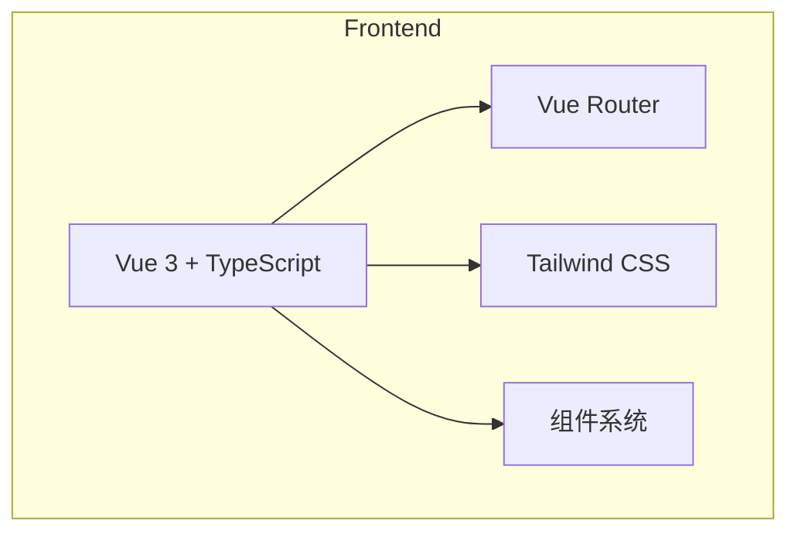

## 1. Architecture Design
纯前端项目，使用 Vue 3 + TypeScript + Tailwind CSS 构建。



## 2. Technology Description
- **Frontend**: Vue@3 + TypeScript + Tailwind CSS + Vite
- **Initialization Tool**: vite-init
- **Backend**: None (纯前端展示项目)

## 3. Route Definitions
| Route | Purpose |
|-------|---------|
| / | 首页 |
| /about | 关于我们 |
| /leaders | 领导班子 |
| /units | 直属单位 |

## 4. Data Structure

### 4.1 领导数据结构
```typescript
interface Leader {
  name: string;
  position: string;
  avatar?: string;
}
```

### 4.2 直属单位数据结构
```typescript
interface Unit {
  name: string;
  description?: string;
}
```

### 4.3 职责数据结构
```typescript
interface Duty {
  id: number;
  content: string;
}
```

