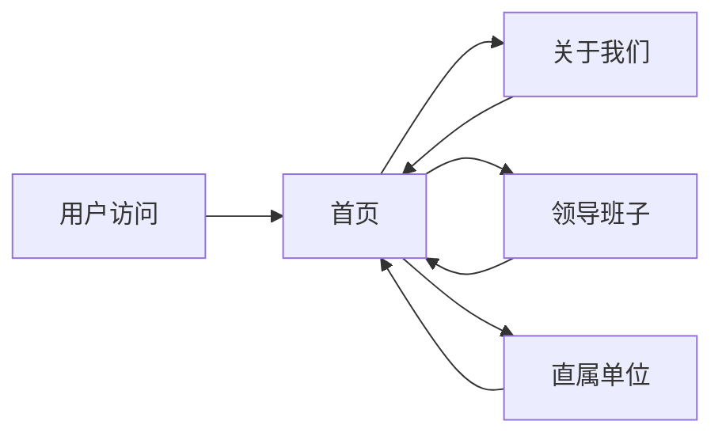

## 1. Product Overview
天津市市政公路管理局官方网站，提供单位介绍、领导班子、直属单位、主要职责等信息展示。
- 主要面向公众和内部人员，展示市政公路管理局的基本情况和工作动态
- 提升政务公开透明度，为社会提供便捷的信息查询服务

## 2. Core Features

### 2.1 Feature Module
1. **首页**: 顶部导航、横幅轮播、单位简介、领导介绍、直属单位、主要职责
2. **关于我们**: 单位历史沿革、详细职责介绍
3. **领导班子**: 领导成员详细信息展示
4. **直属单位**: 各直属单位信息展示

### 2.3 Page Details
| Page Name | Module Name | Feature description |
|-----------|-------------|---------------------|
| 首页 | 顶部导航 | 固定导航栏，包含首页、关于我们、领导班子、直属单位等菜单 |
| 首页 | 横幅轮播 | 展示重要通知或活动图片 |
| 首页 | 单位简介 | 展示市政公路管理局的基本情况 |
| 首页 | 领导介绍 | 展示主要领导信息 |
| 首页 | 直属单位 | 列表展示各直属单位 |
| 首页 | 主要职责 | 展示8项基本职责 |
| 关于我们 | 历史沿革 | 展示2007年组建历史 |
| 关于我们 | 详细职责 | 详细介绍各项职责 |
| 领导班子 | 领导列表 | 卡片式展示所有领导成员信息 |
| 直属单位 | 单位列表 | 网格或列表展示所有直属单位 |

## 3. Core Process
用户访问网站 → 浏览首页信息 → 通过导航菜单查看各栏目详情 → 了解市政公路管理局的工作职能和组织架构

## 4. User Interface Design
### 4.1 Design Style
- **主色调**: 深蓝色 (#1e3a8a)、白色 (#ffffff)
- **辅助色**: 浅蓝色 (#3b82f6)、浅灰色 (#f3f4f6)
- **按钮风格**: 圆角矩形，有悬停效果
- **字体**: 思源黑体，标题加粗
- **布局风格**: 顶部导航 + 分区布局，卡片式设计
- **图标风格**: 简洁的线性图标

### 4.2 Page Design Overview
| Page Name | Module Name | UI Elements |
|-----------|-------------|-------------|
| 首页 | 顶部导航 | 固定在顶部，深蓝色背景，白色文字，悬停变色 |
| 首页 | 横幅轮播 | 全屏宽度，自动轮播，带指示器 |
| 首页 | 单位简介 | 白色卡片，灰色背景，左右布局 |
| 首页 | 领导介绍 | 卡片式，头像+姓名+职务 |
| 首页 | 直属单位 | 网格布局，蓝色边框卡片 |
| 首页 | 主要职责 | 列表式，带图标 |
| 领导班子 | 领导列表 | 响应式网格，卡片悬停效果 |

### 4.3 Responsiveness
- Desktop-first 设计，适配平板和移动设备
- 移动端导航转为汉堡菜单
- 网格布局在小屏幕自动调整为单列

